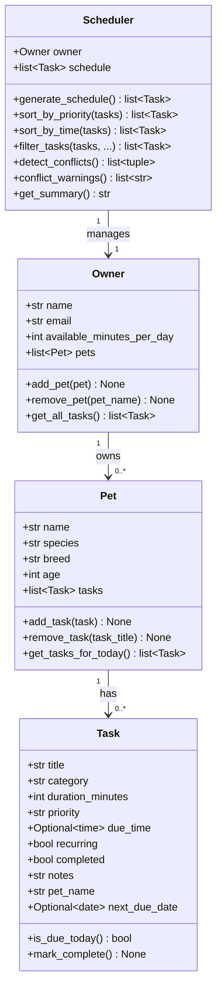

# PawPal+ (Module 2 Project)

**PawPal+** is a smart daily pet care planner built with Python and Streamlit. It helps a busy pet owner stay consistent with feeding, walks, medications, and appointments by generating a prioritised, conflict-aware daily schedule.

---

## Features

| Feature | Description |
|---------|-------------|
| **Multi-pet support** | Register any number of pets (dog, cat, other) under one owner profile. |
| **Task management** | Add care tasks per pet with title, category, duration, priority, due time, and notes. |
| **Priority-based scheduling** | `Scheduler.generate_schedule()` always includes high-priority tasks (e.g. medications) regardless of budget; medium and low tasks fill remaining time. |
| **Sort by time** | The final schedule is reordered chronologically so it reads like a real itinerary. |
| **Daily time budget** | Owner sets an available-minutes limit; tasks that don't fit are surfaced as "deferred" with an explanation. |
| **Recurring tasks** | Marking a recurring task complete schedules its next occurrence for tomorrow via `timedelta(days=1)` — no background job needed. |
| **Conflict detection** | The scheduler flags any two timed tasks whose windows overlap `[start, start + duration)` and displays a prominent warning in the UI. |
| **Filter tasks** | View tasks filtered by pet, category, or completion status using the sidebar controls. |
| **CLI demo** | `main.py` lets you verify all backend logic from the terminal without launching the UI. |

---

## Smarter Scheduling

The scheduling algorithm works in three passes:

1. **Collect** — gather all tasks due today from every pet (`is_due_today()` handles both recurring and one-off tasks).
2. **Sort** — rank by priority (high → medium → low), then by `due_time` within each tier.
3. **Select** — walk the sorted list and accept tasks until the owner's time budget is exhausted; high-priority tasks bypass the budget check entirely.

After selection, a final `sort_by_time()` pass reorders the accepted tasks chronologically for display.

---

## System Architecture

Four classes, three relationships:



---

## Testing PawPal+

```bash
python -m pytest          # quick pass/fail summary
python -m pytest -v       # verbose — shows every test name
```

**44 tests across 5 test classes — all passing.**

| Class | Coverage |
|-------|----------|
| `TestTaskCompletion` | `mark_complete()`, `is_due_today()`, `next_due_date` via `timedelta` |
| `TestPetTaskManagement` | add/remove tasks, `pet_name` tagging, today-filter |
| `TestOwner` | pet registration, removal, task aggregation |
| `TestScheduler` | priority sort, time sort, filter (single + combined), conflict detection, budget enforcement, warning strings |
| `TestEdgeCases` | empty owner/pet, all tasks done, zero budget, touching windows, multiple conflicts, combined filters, recurring reappearance |

**Confidence: ★★★★☆** — backend logic is fully covered; Streamlit UI layer requires manual verification.

---

## Getting Started

### Setup

```bash
python -m venv .venv
source .venv/bin/activate   # Windows: .venv\Scripts\activate
pip install -r requirements.txt
```

### Run the app

```bash
streamlit run app.py
```

### Run the CLI demo

```bash
python main.py
```

### Run the tests

```bash
python -m pytest -v
```

---

## Project Structure

```
pawpal_system.py   — backend logic (Owner, Pet, Task, Scheduler)
app.py             — Streamlit UI
main.py            — CLI demo / manual verification script
tests/
  test_pawpal.py   — 44 automated pytest tests
reflection.md      — design decisions and AI collaboration notes
```
