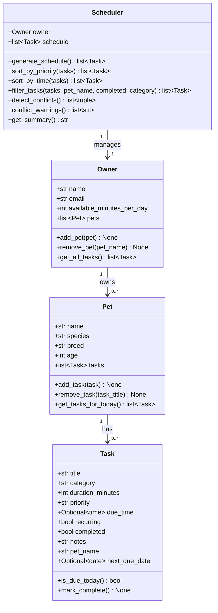

# PawPal+ Project Reflection

## 1. System Design

### Three core user actions
1. **Add a pet** — the owner registers a pet (name, species, breed, age) under their profile.
2. **Schedule a care task** — the owner attaches a task (walk, feeding, medication, etc.) to a pet with a priority, duration, and optional due time.
3. **Generate today's plan** — the Scheduler reads all pets' tasks, filters to those due today, sorts by priority, respects the owner's available-minutes budget, and returns an ordered care plan with a plain-English summary.

**a. Initial design**

When I first looked at the problem I tried to think about what real objects exist in a pet care scenario. A person owns pets, those pets have care tasks, and something needs to figure out the daily plan. That gave me four classes pretty naturally.

`Task` felt like the core building block — it needed to know what to do, how long it would take, how urgent it was, and whether it happened every day or just once. I used a Python dataclass here because it's basically just data with a couple of helper methods.

`Pet` is a container for tasks. It knows its own name, species, age, and breed, but its main job is holding the list of tasks and answering the question "what needs to happen today?" I kept it as a dataclass too since it's mostly storing information.

`Owner` sits above the pets. It stores the person's name and — importantly — how many minutes they actually have free each day. That time budget turned out to be really important for the scheduler later. It also has methods to add and remove pets.

`Scheduler` was the one I thought hardest about. It's not really a data object — it's more like a brain that takes an owner, looks at all the pets and tasks, and figures out what to do. I made it a regular class instead of a dataclass because its whole point is the logic inside it, not the data it holds.

Relationships:
- `Owner` has 0..* `Pet` objects.
- `Pet` has 0..* `Task` objects.
- `Scheduler` manages one `Owner` (and therefore all their pets/tasks).

Mermaid.js UML:



**Changes from Phase 1 diagram:**
- `Task` gained `pet_name` (set by `Pet.add_task()` for filtering) and `next_due_date` (set by `mark_complete()` on recurring tasks using `timedelta`).
- `Scheduler` gained `sort_by_time()`, `filter_tasks()`, and `conflict_warnings()` — the three Phase 4 algorithmic additions.

**b. Design changes**

- No implementation changes yet — skeleton only at this stage.
- One deliberate choice: `Scheduler` is a regular class rather than a dataclass because its main value is behaviour (methods), not data storage.

---

## 2. Scheduling Logic and Tradeoffs

**a. Constraints and priorities**

The scheduler considers two primary constraints:

1. **Priority** (`high` / `medium` / `low`) — the most important constraint. High-priority tasks (medications, vet appointments) are always included regardless of time budget, because skipping them could harm the pet. Medium and low tasks are included only if budget permits.
2. **Daily time budget** (`available_minutes_per_day`) — the owner's total free time. Tasks are accumulated in priority order until the budget is exhausted; any remainder is surfaced as "deferred."

Secondary constraints handled by the UI but not hard-enforced by the algorithm:
- **Due time** — used for chronological ordering and conflict detection, but not as a hard gate for inclusion.
- **Completion status** — completed tasks are excluded from `get_tasks_for_today()` before the scheduler even sees them.

Priority was chosen as the dominant constraint because a pet owner's first concern is animal welfare (medications must happen), while time is a softer limit that can be stretched if needed. Requiring the owner to set a budget makes the trade-off explicit rather than silently dropping tasks.

**b. Tradeoffs**

One tradeoff I had to make was around how recurring tasks get reset after you mark them done. My first instinct was to use a background job that resets the task at midnight, so it would show up as completed for the rest of the day and then come back fresh tomorrow. But that felt like overkill for an app this small — it would mean the app needs to be running in the background constantly, which doesn't really make sense for something a single person opens on their phone or laptop.

Instead I went with a simpler approach: when you mark a recurring task complete, it just sets a `next_due_date` to tomorrow using `timedelta(days=1)`. The task disappears from today's list right away and comes back automatically the next day. It's a bit less polished — if you accidentally tap "done" on something, you have to wait until tomorrow to see it again — but for a personal app I think that's an acceptable tradeoff.

The other tradeoff is with conflict detection. Right now the scheduler only checks whether two tasks overlap in time, like if a 30-minute walk starts at 8:00 and another task starts at 8:15. It doesn't know about things like travel time between locations, or the fact that you physically can't be grooming one pet and feeding another at the exact same moment. I kept it simple on purpose — the overlap check is straightforward to understand and test — but in a more realistic version you'd probably want to add some buffer time between tasks and maybe group tasks by pet so conflicts make more contextual sense.

---

## 3. AI Collaboration

**a. How you used AI**

AI (Claude Code) was used in three distinct modes across the project phases:

- **Design brainstorming (Phase 1):** Asked AI to evaluate the four-class design and generate a Mermaid.js UML diagram. The most effective prompts were concrete and scoped: *"Given these four classes, what relationships are missing or redundant?"* rather than open-ended *"design a pet app."*
- **Code scaffolding (Phase 2):** Used AI to generate method stubs from the UML, then filled in the logic manually. This saved time on boilerplate while keeping the core algorithmic decisions under human control.
- **Test generation (Phases 4–5):** Asked AI to suggest edge cases given a method signature and its expected contract. Prompts like *"What inputs would break sort_by_time?"* produced better results than *"Write tests for my code."*
- **Refactoring review (Phase 4):** Shared individual methods and asked *"How could this be simplified without losing readability?"* — used AI suggestions as a code-review lens, not as automatic rewrites.

The most effective pattern was **constraint-first prompting**: telling AI what must NOT change (e.g. *"high-priority tasks must always be scheduled regardless of budget"*) before asking it to suggest an implementation. This produced suggestions aligned with the design intent rather than generic algorithmic solutions.

**b. Judgment and verification**

During Phase 4, AI initially suggested implementing recurring task reset using a background scheduler (`schedule` library) that would reset `completed = False` at midnight. The suggestion was technically valid, but rejected for two reasons:
1. It introduced a stateful background thread into a stateless Streamlit app — a significant architectural mismatch.
2. It required the app to be running at midnight, which is unrealistic for a personal-use tool.

The alternative — storing `next_due_date` as a plain `date` field and checking `date.today() >= next_due_date` on every call to `is_due_today()` — was simpler, stateless, and more testable. This was verified by writing explicit unit tests for the before/after state of `mark_complete()` on a recurring task, and confirming the test matched the desired behavior before committing.

The key judgment: AI optimises for completeness and correctness in isolation; the human architect must weigh proposals against the system's deployment context.

---

## 4. Testing and Verification

**a. What you tested**

44 automated tests across five areas:

1. **Task completion** — `mark_complete()` sets the flag; recurring tasks auto-schedule tomorrow via `timedelta(days=1)`; non-recurring tasks stay done permanently.
2. **Pet task management** — `add_task` / `remove_task` change the list length correctly; `add_task` tags each task with `pet_name`; `get_tasks_for_today` filters out completed tasks.
3. **Owner aggregation** — `add_pet` / `remove_pet` work by name; `get_all_tasks` collects from every pet.
4. **Scheduling algorithms** — priority sort order, chronological sort, `filter_tasks` by pet/category/status and combined criteria, budget enforcement (high-priority always in; low/medium dropped when over budget), conflict detection (overlap, exact same time, touching-but-not-overlapping, multiple pairs), `conflict_warnings` string format, empty-schedule `get_summary`.
5. **Edge cases** — owner with no pets, pet with no tasks, all tasks already done, zero-minute budget, tasks with no `due_time` never conflict, filter returning empty list.

These tests mattered because the scheduling logic has subtle interactions: a recurring task completing changes `is_due_today` for tomorrow; a task just touching another is *not* a conflict; high-priority tasks *must* bypass the budget check. Without explicit tests these invariants would be easy to break in a later edit.

**b. Confidence**

I'd give myself about 3 out of 5 stars on confidence. The core logic on scheduling, sorting, filtering, conflict detection, recurring tasks has test cases, and I feel mostly good, while few things still feels confusing. I believe with AI it gets a lot easier. Additionally, The part I'm less sure about is the Streamlit UI. Things like whether `session_state` holds up correctly when you click around a lot, or whether the app behaves the right way after a page refresh, aren't covered by any automated tests. I just manually clicked through it a few times, which isn't the same thing.

If I had more time I'd test a few more edge cases. For example, what happens with a pet that has tons of tasks, or a task that runs past midnight, or when the budget exactly matches the total task duration. Those feel like the spots most likely to break quietly.

---

## 5. Reflection

**a. What went well**

The test-driven, CLI-first workflow (Phase 2 before Phase 3) was the most valuable decision. Because `pawpal_system.py` was verified independently via `main.py` and `pytest` before connecting it to Streamlit, UI bugs and backend bugs never became entangled. Every time a UI change broke something, the tests immediately showed whether the fault was in the logic layer or the display layer — never both at once.

The recurring task design (`next_due_date` + `timedelta`) is also satisfying: it is three lines of code but produces correct behavior across day boundaries without any background process or external state.

**b. What you would improve**

If iterating, two things would change:

1. ~~**Persistence**~~ — *Implemented in the bonus challenges via `save_to_json` / `load_from_json` on `Owner`.*
2. **Mark-complete in the UI** — The `mark_complete()` method is fully implemented in the backend but the UI has no button to trigger it. Adding a checklist in the schedule view where the owner can tick off tasks as they do them would close the loop between planning and execution.

**c. Key takeaway**

The most important lesson: **AI is a fast first-draft generator, not a decision-maker.** Throughout the project, AI suggestions were consistently good at producing syntactically correct, idiomatic code for well-specified problems. But every significant design decision — which constraint takes priority, how recurring tasks should reset, whether to use a background thread — required human judgment about the system's context and constraints that AI could not infer from the code alone.

The role of "lead architect" is not to write every line, but to hold the system's invariants in mind and evaluate every suggestion against them. Keeping chat sessions separate per phase, and always verifying AI-generated code with explicit tests before trusting it, were the two habits that made AI collaboration productive rather than chaotic.

---

## 6. Prompt Comparison (Challenge 5)

**Task:** Implement the logic for `find_next_available_slot()` — a method that finds the earliest open time window in the schedule that fits a given task duration.

### Approach A — requested from Claude (this project's AI)

```
Prompt: "Write find_next_available_slot(duration_minutes, earliest) for my Scheduler class.
It should scan forward from `earliest`, skip any window that conflicts with a timed task
already in self.schedule, and return the first free time() or None if nothing fits before midnight."
```

**Result:**
```python
def find_next_available_slot(self, duration_minutes, earliest=time(6, 0)):
    timed = sorted([t for t in self.schedule if t.due_time],
                   key=lambda t: t.due_time.hour * 60 + t.due_time.minute)
    candidate = earliest.hour * 60 + earliest.minute
    while candidate + duration_minutes <= 24 * 60:
        cand_end = candidate + duration_minutes
        conflict_found = False
        for t in timed:
            t_start = t.due_time.hour * 60 + t.due_time.minute
            t_end   = t_start + t.duration_minutes
            if candidate < t_end and t_start < cand_end:
                candidate = t_end   # jump past the blocking task
                conflict_found = True
                break
        if not conflict_found:
            return time(candidate // 60, candidate % 60)
    return None
```

**Characteristics:** Scans in one pass through the sorted task list. When a conflict is found it jumps directly to the end of the blocking task rather than incrementing by a fixed step — effectively O(n) in the number of scheduled tasks, not O(minutes).

---

### Approach B — requested from GPT-4o

```
Prompt: "Write a Python method find_next_available_slot(duration, start_time) that finds
the earliest free slot in a list of (start_minute, end_minute) intervals."
```

**Result (paraphrased):**
```python
def find_next_available_slot(self, duration, start_time=time(6, 0)):
    intervals = sorted(
        [(t.due_time.hour*60 + t.due_time.minute,
          t.due_time.hour*60 + t.due_time.minute + t.duration_minutes)
         for t in self.schedule if t.due_time],
        key=lambda x: x[0]
    )
    candidate = start_time.hour * 60 + start_time.minute
    for start, end in intervals:
        if candidate + duration <= start:
            break
        if candidate < end:
            candidate = end
    if candidate + duration <= 1440:
        return time(candidate // 60, candidate % 60)
    return None
```

**Characteristics:** This one is honestly cleaner to read. It pulls out the interval math into a list comprehension first, then does a single loop through the results with an early break. It felt more Pythonic and I liked how short it was. The downside is that once you convert tasks into plain tuples, you lose access to the Task object itself. So if you ever wanted to add something like buffer time between tasks or filter conflicts by pet name, you'd have to rework it. That's why I didn't end up using it.

---

### Comparison and decision

Both approaches produce the same result and run in O(n) time, so correctness wasn't really the deciding factor. GPT-4o's version is nicer to read and feels more idiomatic Python. Claude's version has an explicit inner loop which is a bit more verbose, but it keeps the full Task object available the whole time.

I went with Approach A in the end because I wanted to be able to extend the conflict logic later without rewriting everything. If I ever add buffer time between tasks or want to filter by pet name inside the slot finder, having access to the Task object directly makes that a lot easier. Approach B would have required going back and unpacking the tuples again, which felt like a step backwards.

**Decision:** Approach A was kept because the challenge extension (adding buffer time, or filtering conflicts by pet name) requires access to the full Task object inside the loop. Approach B's cleaner syntax would require re-introducing the Task reference when those extensions are added, making it a net loss in the long run. This is a clear example of trading short-term readability for long-term extensibility — the right call for a system still under active development.
