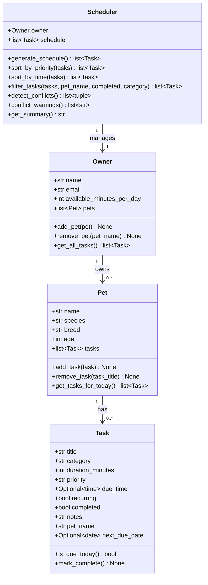

# PawPal+ Project Reflection

## 1. System Design

### Three core user actions
1. **Add a pet** - the owner registers a pet (name, species, breed, age) under their profile.
2. **Schedule a care task** - the owner attaches a task (walk, feeding, medication, etc.) to a pet with a priority, duration, and optional due time.
3. **Generate today's plan** - the Scheduler reads all pets' tasks, filters to those due today, sorts by priority, respects the owner's available-minutes budget, and returns an ordered care plan.

**a. Initial design**

When I first looked at the problem I tried to think about what real objects exist in a pet care scenario. A person owns pets, those pets have care tasks, and something needs to figure out the daily plan. That gave me four classes pretty naturally.

`Task` felt like the core building block. It needed to know what to do, how long it would take, how urgent it was, and whether it happened every day or just once. I used a Python dataclass here because it's basically just data with a couple of helper methods.

`Pet` is a container for tasks. It knows its own name, species, age, and breed, but its main job is holding the list of tasks and answering the question "what needs to happen today?" I kept it as a dataclass too since it's mostly storing information.

`Owner` sits above the pets. It stores the person's name and, importantly, how many minutes they actually have free each day. That time budget turned out to be really important for the scheduler later. It also has methods to add and remove pets.

`Scheduler` was the one I thought hardest about. It's not really a data object, it's more like a brain that takes an owner, looks at all the pets and tasks, and figures out what to do. I made it a regular class instead of a dataclass because its whole point is the logic inside it, not the data it holds.

Relationships:
- `Owner` has 0..* `Pet` objects.
- `Pet` has 0..* `Task` objects.
- `Scheduler` manages one `Owner` (and therefore all their pets/tasks).

Mermaid.js UML:



**Changes from Phase 1 diagram:**
- `Task` gained `pet_name` (set by `Pet.add_task()` for filtering) and `next_due_date` (set by `mark_complete()` on recurring tasks using `timedelta`).
- `Scheduler` gained `sort_by_time()`, `filter_tasks()`, and `conflict_warnings()` as part of the Phase 4 algorithmic additions.

**b. Design changes**

- No implementation changes yet at this stage, just the skeleton.
- One deliberate choice was making `Scheduler` a regular class rather than a dataclass because its main value is the behaviour in its methods, not the data it holds.

---

## 2. Scheduling Logic and Tradeoffs

**a. Constraints and priorities**

The scheduler mainly considers two things: priority and time budget.

Priority was the most important one to get right. High-priority tasks like medications and vet appointments always make it into the schedule no matter what, because skipping them could actually harm the pet. Medium and low priority tasks only get included if there's still time left in the budget.

The daily time budget is the other main constraint. The owner sets how many minutes they have free, and the scheduler fills that up in priority order. Anything that doesn't fit gets shown as deferred so the owner knows it was skipped.

Due time and completion status also play a role, just more quietly. Due times are used for ordering and conflict checking but don't block a task from being included. Completed tasks get filtered out before the scheduler even sees them.

I made priority the dominant rule because a pet owner cares most about the animal's wellbeing. Time is flexible, but medications aren't.

**b. Tradeoffs**

One tradeoff I had to make was around how recurring tasks get reset after you mark them done. My first instinct was to use a background job that resets the task at midnight, so it would show up as completed for the rest of the day and then come back fresh tomorrow. But that felt like overkill for an app this small. It would mean the app needs to be running in the background constantly, which doesn't really make sense for something a single person opens on their phone or laptop.

Instead I went with a simpler approach: when you mark a recurring task complete, it just sets a `next_due_date` to tomorrow using `timedelta(days=1)`. The task disappears from today's list right away and comes back automatically the next day. It's a bit less polished. If you accidentally tap "done" on something, you have to wait until tomorrow to see it again. But for a personal app I think that's an acceptable tradeoff.

The other tradeoff is with conflict detection. Right now the scheduler only checks whether two tasks overlap in time, like if a 30-minute walk starts at 8:00 and another task starts at 8:15. It doesn't know about things like travel time between locations, or the fact that you physically can't be grooming one pet and feeding another at the exact same moment. I kept it simple on purpose. The overlap check is straightforward to understand and test. But in a more realistic version you'd probably want to add some buffer time between tasks and maybe group conflicts by pet so they make more contextual sense.

---

## 3. AI Collaboration

**a. How you used AI**

I used AI (Claude Code) in a few different ways throughout the project.

During the design phase I asked it to look at my four-class idea and help generate the UML diagram. The prompts that worked best were specific ones like "given these four classes, what relationships are missing?" rather than something vague like "design a pet app."

For the code itself I mostly used AI to generate the method stubs first, then filled in the logic myself. That saved a lot of time on the boring boilerplate parts while keeping the actual decisions in my hands.

For testing I found it really helpful to ask things like "what inputs would break sort_by_time?" rather than "write tests for my code." The edge-case focused questions got much better results.

I also used it occasionally as a code reviewer. I'd share a method and ask if it could be simplified, then decide whether the suggestion actually made things better or just shorter.

**b. Judgment and verification**

During Phase 4, AI suggested using a background scheduler library to reset recurring tasks at midnight. Technically it would have worked, but I didn't go with it for two reasons. First, it would have introduced a background thread into a Streamlit app that's supposed to be stateless, which felt like a bad fit. Second, it would require the app to be running at midnight, which just isn't realistic for a personal tool.

I went with storing a `next_due_date` field instead and checking `date.today() >= next_due_date` each time. It's simpler, easier to test, and doesn't need anything running in the background. I wrote unit tests to confirm the before and after state of `mark_complete()` before committing anything.

The main thing I took away from that moment was that AI tends to give you complete and technically correct answers, but it doesn't know anything about how your app is actually going to be used. That part is still on you.

---

## 4. Testing and Verification

**a. What you tested**

I wrote 62 automated tests across seven areas:

1. **Task completion** - `mark_complete()` sets the flag; recurring tasks auto-schedule tomorrow via `timedelta(days=1)`; non-recurring tasks stay done permanently.
2. **Pet task management** - `add_task` and `remove_task` change the list count correctly; `add_task` tags each task with `pet_name`; `get_tasks_for_today` filters out completed tasks.
3. **Owner aggregation** - `add_pet` and `remove_pet` work by name; `get_all_tasks` collects from every pet.
4. **Scheduling algorithms** - priority sort order, chronological sort, `filter_tasks` by pet/category/status and combined criteria, budget enforcement, conflict detection, `conflict_warnings` string format, and empty-schedule `get_summary`.
5. **Edge cases** - owner with no pets, pet with no tasks, all tasks already done, zero-minute budget, tasks with no `due_time` never conflict, filter returning empty list.
6. **Persistence** - `to_dict` and `from_dict` roundtrips for Task, Pet, and Owner; `save_to_json` and `load_from_json` using a temp file.
7. **Advanced scheduling** - `score_task` ordering, weighted schedule budget and bypass rules, `find_next_available_slot` across several scenarios.

Testing mattered a lot because the scheduling logic has some tricky interactions. A recurring task completing changes whether it shows up tomorrow. A task that ends exactly when another starts is not a conflict. High-priority tasks must always make the schedule even if the budget is zero. Without tests, any of those could break silently in a later edit.

**b. Confidence**

I'd give myself about 3 out of 5 stars on confidence. The core logic on scheduling, sorting, filtering, conflict detection, and recurring tasks all has test cases and I feel mostly good about it. A few things still feel a bit uncertain, and I think working with AI made a lot of the harder parts more approachable than they would have been otherwise.

The part I'm less sure about is the Streamlit UI. Things like whether `session_state` holds up correctly when you click around a lot, or whether the app behaves the right way after a page refresh, aren't covered by any automated tests. I just manually clicked through it a few times, which isn't the same thing.

If I had more time I'd test a few more edge cases. For example, what happens with a pet that has tons of tasks, or a task that runs past midnight, or when the budget exactly matches the total task duration. Those feel like the spots most likely to break quietly.

---

## 5. Reflection

**a. What went well**

The test-driven, CLI-first workflow worked really well. Because I verified `pawpal_system.py` independently through `main.py` and `pytest` before touching the Streamlit UI, backend bugs and UI bugs never got mixed up. Whenever something broke after a UI change, the tests made it clear whether the problem was in the logic or the display layer.

The recurring task design using `next_due_date` and `timedelta` also came out nicely. It's only a few lines of code but handles day boundaries correctly without needing any background process.

**b. What you would improve**

If I was doing another iteration, the main thing I'd add is a way to mark tasks complete directly in the UI. The `mark_complete()` method works fine in the backend but there's no button for it in the app. Adding a checklist in the schedule view would make the app feel a lot more useful day to day.

Persistence is already handled through `save_to_json` and `load_from_json`, which was one of the bonus challenges.

**c. Key takeaway**

The biggest thing I learned is that AI is really good at generating a first draft quickly, but it's not great at making design decisions. Every time I asked it to suggest an implementation, it gave me something that worked in isolation. But whether that implementation actually fit the system, the deployment context, and the constraints I'd already set, that was always something I had to figure out myself.

Being the lead architect mostly meant knowing what questions to ask and being willing to push back when a suggestion didn't fit, even if it looked good on the surface.

---

## 6. Prompt Comparison (Challenge 5)

**Task:** Implement `find_next_available_slot()`, a method that finds the earliest open time window in the schedule that fits a given task duration.

### Approach A - requested from Claude (this project's AI)

```
Prompt: "Write find_next_available_slot(duration_minutes, earliest) for my Scheduler class.
It should scan forward from `earliest`, skip any window that conflicts with a timed task
already in self.schedule, and return the first free time() or None if nothing fits before midnight."
```

**Result:**
```python
def find_next_available_slot(self, duration_minutes, earliest=time(6, 0)):
    timed = sorted([t for t in self.schedule if t.due_time],
                   key=lambda t: t.due_time.hour * 60 + t.due_time.minute)
    candidate = earliest.hour * 60 + earliest.minute
    while candidate + duration_minutes <= 24 * 60:
        cand_end = candidate + duration_minutes
        conflict_found = False
        for t in timed:
            t_start = t.due_time.hour * 60 + t.due_time.minute
            t_end   = t_start + t.duration_minutes
            if candidate < t_end and t_start < cand_end:
                candidate = t_end   # jump past the blocking task
                conflict_found = True
                break
        if not conflict_found:
            return time(candidate // 60, candidate % 60)
    return None
```

**Notes:** It scans through the sorted task list and when it hits a conflict, it jumps directly to the end of the blocking task instead of stepping forward one minute at a time. That keeps it efficient even with a lot of tasks.

---

### Approach B - requested from GPT-4o

```
Prompt: "Write a Python method find_next_available_slot(duration, start_time) that finds
the earliest free slot in a list of (start_minute, end_minute) intervals."
```

**Result (paraphrased):**
```python
def find_next_available_slot(self, duration, start_time=time(6, 0)):
    intervals = sorted(
        [(t.due_time.hour*60 + t.due_time.minute,
          t.due_time.hour*60 + t.due_time.minute + t.duration_minutes)
         for t in self.schedule if t.due_time],
        key=lambda x: x[0]
    )
    candidate = start_time.hour * 60 + start_time.minute
    for start, end in intervals:
        if candidate + duration <= start:
            break
        if candidate < end:
            candidate = end
    if candidate + duration <= 1440:
        return time(candidate // 60, candidate % 60)
    return None
```

**Notes:** This one is honestly cleaner to read. It pulls out the interval math into a list comprehension first, then does a single loop through the results with an early break. It felt more Pythonic and I liked how short it was. The downside is that once you convert tasks into plain tuples, you lose access to the Task object itself. So if you ever wanted to add something like buffer time between tasks or filter conflicts by pet name, you'd have to rework it. That's why I didn't end up using it.

---

### Comparison and decision

Both approaches produce the same result and run in O(n) time, so correctness wasn't really the deciding factor. GPT-4o's version is nicer to read and feels more idiomatic Python. Claude's version has an explicit inner loop which is a bit more verbose, but it keeps the full Task object available the whole time.

I went with Approach A in the end because I wanted to be able to extend the conflict logic later without rewriting everything. If I ever add buffer time between tasks or want to filter by pet name inside the slot finder, having access to the Task object directly makes that a lot easier. Approach B would have required going back and unpacking the tuples again, which felt like a step backwards.


### Comparison and decision

This project was comparatively harder for me, actually second harder. The hardest, so far, was the first assignment. I was confused on almost every phase. With the help of AI's simplified explaination, it became easy for me to better understand the realtionship in UML diagram. 