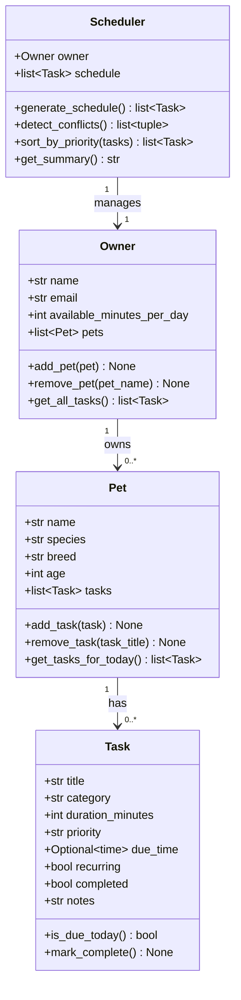

# PawPal+ Project Reflection

## 1. System Design

### Three core user actions
1. **Add a pet** — the owner registers a pet (name, species, breed, age) under their profile.
2. **Schedule a care task** — the owner attaches a task (walk, feeding, medication, etc.) to a pet with a priority, duration, and optional due time.
3. **Generate today's plan** — the Scheduler reads all pets' tasks, filters to those due today, sorts by priority, respects the owner's available-minutes budget, and returns an ordered care plan with a plain-English summary.

**a. Initial design**

Four classes were chosen:

| Class | Responsibility |
|-------|---------------|
| `Task` | Represents a single care item. Holds what needs to happen (`title`, `category`), how long it takes (`duration_minutes`), urgency (`priority`), when it should occur (`due_time`), and whether it repeats (`recurring`). Implemented as a Python `dataclass`. |
| `Pet` | Represents one animal. Owns a list of `Task` objects and exposes helpers to add/remove tasks and retrieve only those due today. Also a `dataclass`. |
| `Owner` | Represents the human. Owns a list of `Pet` objects and a daily time budget (`available_minutes_per_day`). Aggregates tasks across all pets for the scheduler. |
| `Scheduler` | Orchestrates the planning logic. Takes an `Owner`, collects today's tasks, sorts them by priority, checks the time budget, detects time conflicts between tasks, and produces a readable summary. Plain class (not a dataclass). |

Relationships:
- `Owner` has 0..* `Pet` objects.
- `Pet` has 0..* `Task` objects.
- `Scheduler` manages one `Owner` (and therefore all their pets/tasks).

Mermaid.js UML:

**b. Design changes**

- No implementation changes yet — skeleton only at this stage.
- One deliberate choice: `Scheduler` is a regular class rather than a dataclass because its main value is behaviour (methods), not data storage.

---

## 2. Scheduling Logic and Tradeoffs

**a. Constraints and priorities**

- What constraints does your scheduler consider (for example: time, priority, preferences)?
- How did you decide which constraints mattered most?

**b. Tradeoffs**

One tradeoff in the scheduler is **how recurring tasks are reset after completion**.

When `mark_complete()` is called on a recurring task, `next_due_date` is set to `date.today() + timedelta(days=1)`, making the task disappear from today's schedule immediately. An alternative would be to reset it at midnight using a background job, keeping it visible as "done" for the rest of the day.

The timedelta approach was chosen because it is simple, stateless, and requires no background process — appropriate for a single-user app where the owner marks things off as they go. The tradeoff is that if the owner accidentally marks a task complete, it won't reappear until tomorrow.

A second tradeoff is **conflict detection by overlapping time windows only**. The scheduler flags conflicts between any two timed tasks whose windows intersect, but it does not account for travel time between locations or the owner having two pets that need simultaneous attention. This keeps the algorithm O(n²) and easy to reason about, at the cost of missing some real-world scheduling constraints.

---

## 3. AI Collaboration

**a. How you used AI**

- How did you use AI tools during this project (for example: design brainstorming, debugging, refactoring)?
- What kinds of prompts or questions were most helpful?

**b. Judgment and verification**

- Describe one moment where you did not accept an AI suggestion as-is.
- How did you evaluate or verify what the AI suggested?

---

## 4. Testing and Verification

**a. What you tested**

44 automated tests across five areas:

1. **Task completion** — `mark_complete()` sets the flag; recurring tasks auto-schedule tomorrow via `timedelta(days=1)`; non-recurring tasks stay done permanently.
2. **Pet task management** — `add_task` / `remove_task` change the list length correctly; `add_task` tags each task with `pet_name`; `get_tasks_for_today` filters out completed tasks.
3. **Owner aggregation** — `add_pet` / `remove_pet` work by name; `get_all_tasks` collects from every pet.
4. **Scheduling algorithms** — priority sort order, chronological sort, `filter_tasks` by pet/category/status and combined criteria, budget enforcement (high-priority always in; low/medium dropped when over budget), conflict detection (overlap, exact same time, touching-but-not-overlapping, multiple pairs), `conflict_warnings` string format, empty-schedule `get_summary`.
5. **Edge cases** — owner with no pets, pet with no tasks, all tasks already done, zero-minute budget, tasks with no `due_time` never conflict, filter returning empty list.

These tests mattered because the scheduling logic has subtle interactions: a recurring task completing changes `is_due_today` for tomorrow; a task just touching another is *not* a conflict; high-priority tasks *must* bypass the budget check. Without explicit tests these invariants would be easy to break in a later edit.

**b. Confidence**

★★★★☆ — The backend logic is well-covered. The remaining uncertainty is in the Streamlit UI (`app.py`): `session_state` persistence and re-run behaviour are not covered by automated tests, so a manual walkthrough is still needed for the UI layer. If I had more time I would add tests for: a pet with 50+ tasks (performance), tasks that span midnight (edge of day boundary), and an owner whose available minutes exactly equals the total task duration (boundary condition).

---

## 5. Reflection

**a. What went well**

- What part of this project are you most satisfied with?

**b. What you would improve**

- If you had another iteration, what would you improve or redesign?

**c. Key takeaway**

- What is one important thing you learned about designing systems or working with AI on this project?
