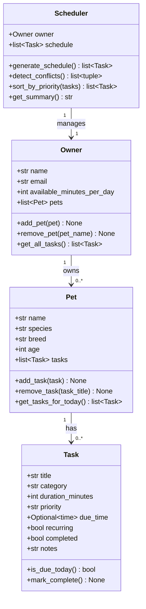

# PawPal+ Project Reflection

## 1. System Design

### Three core user actions
1. **Add a pet** — the owner registers a pet (name, species, breed, age) under their profile.
2. **Schedule a care task** — the owner attaches a task (walk, feeding, medication, etc.) to a pet with a priority, duration, and optional due time.
3. **Generate today's plan** — the Scheduler reads all pets' tasks, filters to those due today, sorts by priority, respects the owner's available-minutes budget, and returns an ordered care plan with a plain-English summary.

**a. Initial design**

Four classes were chosen:

| Class | Responsibility |
|-------|---------------|
| `Task` | Represents a single care item. Holds what needs to happen (`title`, `category`), how long it takes (`duration_minutes`), urgency (`priority`), when it should occur (`due_time`), and whether it repeats (`recurring`). Implemented as a Python `dataclass`. |
| `Pet` | Represents one animal. Owns a list of `Task` objects and exposes helpers to add/remove tasks and retrieve only those due today. Also a `dataclass`. |
| `Owner` | Represents the human. Owns a list of `Pet` objects and a daily time budget (`available_minutes_per_day`). Aggregates tasks across all pets for the scheduler. |
| `Scheduler` | Orchestrates the planning logic. Takes an `Owner`, collects today's tasks, sorts them by priority, checks the time budget, detects time conflicts between tasks, and produces a readable summary. Plain class (not a dataclass). |

Relationships:
- `Owner` has 0..* `Pet` objects.
- `Pet` has 0..* `Task` objects.
- `Scheduler` manages one `Owner` (and therefore all their pets/tasks).

Mermaid.js UML:

**b. Design changes**

- No implementation changes yet — skeleton only at this stage.
- One deliberate choice: `Scheduler` is a regular class rather than a dataclass because its main value is behaviour (methods), not data storage.

---

## 2. Scheduling Logic and Tradeoffs

**a. Constraints and priorities**

- What constraints does your scheduler consider (for example: time, priority, preferences)?
- How did you decide which constraints mattered most?

**b. Tradeoffs**

- Describe one tradeoff your scheduler makes.
- Why is that tradeoff reasonable for this scenario?

---

## 3. AI Collaboration

**a. How you used AI**

- How did you use AI tools during this project (for example: design brainstorming, debugging, refactoring)?
- What kinds of prompts or questions were most helpful?

**b. Judgment and verification**

- Describe one moment where you did not accept an AI suggestion as-is.
- How did you evaluate or verify what the AI suggested?

---

## 4. Testing and Verification

**a. What you tested**

- What behaviors did you test?
- Why were these tests important?

**b. Confidence**

- How confident are you that your scheduler works correctly?
- What edge cases would you test next if you had more time?

---

## 5. Reflection

**a. What went well**

- What part of this project are you most satisfied with?

**b. What you would improve**

- If you had another iteration, what would you improve or redesign?

**c. Key takeaway**

- What is one important thing you learned about designing systems or working with AI on this project?
