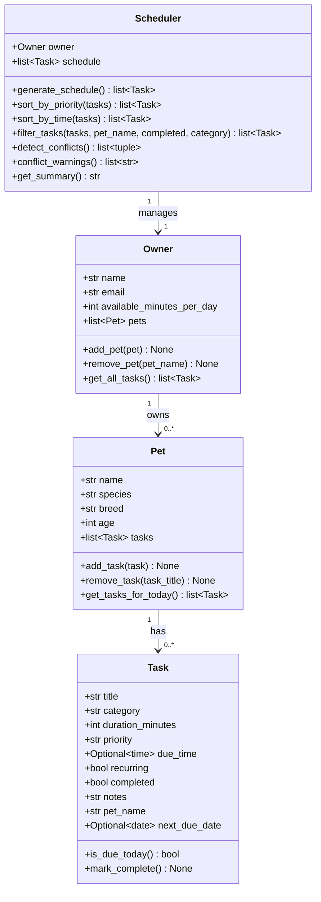

# PawPal+ Project Reflection

## 1. System Design

### Three core user actions
1. **Add a pet** — the owner registers a pet (name, species, breed, age) under their profile.
2. **Schedule a care task** — the owner attaches a task (walk, feeding, medication, etc.) to a pet with a priority, duration, and optional due time.
3. **Generate today's plan** — the Scheduler reads all pets' tasks, filters to those due today, sorts by priority, respects the owner's available-minutes budget, and returns an ordered care plan with a plain-English summary.

**a. Initial design**

Four classes were chosen:

| Class | Responsibility |
|-------|---------------|
| `Task` | Represents a single care item. Holds what needs to happen (`title`, `category`), how long it takes (`duration_minutes`), urgency (`priority`), when it should occur (`due_time`), and whether it repeats (`recurring`). Implemented as a Python `dataclass`. |
| `Pet` | Represents one animal. Owns a list of `Task` objects and exposes helpers to add/remove tasks and retrieve only those due today. Also a `dataclass`. |
| `Owner` | Represents the human. Owns a list of `Pet` objects and a daily time budget (`available_minutes_per_day`). Aggregates tasks across all pets for the scheduler. |
| `Scheduler` | Orchestrates the planning logic. Takes an `Owner`, collects today's tasks, sorts them by priority, checks the time budget, detects time conflicts between tasks, and produces a readable summary. Plain class (not a dataclass). |

Relationships:
- `Owner` has 0..* `Pet` objects.
- `Pet` has 0..* `Task` objects.
- `Scheduler` manages one `Owner` (and therefore all their pets/tasks).

Mermaid.js UML:



**Changes from Phase 1 diagram:**
- `Task` gained `pet_name` (set by `Pet.add_task()` for filtering) and `next_due_date` (set by `mark_complete()` on recurring tasks using `timedelta`).
- `Scheduler` gained `sort_by_time()`, `filter_tasks()`, and `conflict_warnings()` — the three Phase 4 algorithmic additions.

**b. Design changes**

- No implementation changes yet — skeleton only at this stage.
- One deliberate choice: `Scheduler` is a regular class rather than a dataclass because its main value is behaviour (methods), not data storage.

---

## 2. Scheduling Logic and Tradeoffs

**a. Constraints and priorities**

The scheduler considers two primary constraints:

1. **Priority** (`high` / `medium` / `low`) — the most important constraint. High-priority tasks (medications, vet appointments) are always included regardless of time budget, because skipping them could harm the pet. Medium and low tasks are included only if budget permits.
2. **Daily time budget** (`available_minutes_per_day`) — the owner's total free time. Tasks are accumulated in priority order until the budget is exhausted; any remainder is surfaced as "deferred."

Secondary constraints handled by the UI but not hard-enforced by the algorithm:
- **Due time** — used for chronological ordering and conflict detection, but not as a hard gate for inclusion.
- **Completion status** — completed tasks are excluded from `get_tasks_for_today()` before the scheduler even sees them.

Priority was chosen as the dominant constraint because a pet owner's first concern is animal welfare (medications must happen), while time is a softer limit that can be stretched if needed. Requiring the owner to set a budget makes the trade-off explicit rather than silently dropping tasks.

**b. Tradeoffs**

One tradeoff in the scheduler is **how recurring tasks are reset after completion**.

When `mark_complete()` is called on a recurring task, `next_due_date` is set to `date.today() + timedelta(days=1)`, making the task disappear from today's schedule immediately. An alternative would be to reset it at midnight using a background job, keeping it visible as "done" for the rest of the day.

The timedelta approach was chosen because it is simple, stateless, and requires no background process — appropriate for a single-user app where the owner marks things off as they go. The tradeoff is that if the owner accidentally marks a task complete, it won't reappear until tomorrow.

A second tradeoff is **conflict detection by overlapping time windows only**. The scheduler flags conflicts between any two timed tasks whose windows intersect, but it does not account for travel time between locations or the owner having two pets that need simultaneous attention. This keeps the algorithm O(n²) and easy to reason about, at the cost of missing some real-world scheduling constraints.

---

## 3. AI Collaboration

**a. How you used AI**

AI (Claude Code) was used in three distinct modes across the project phases:

- **Design brainstorming (Phase 1):** Asked AI to evaluate the four-class design and generate a Mermaid.js UML diagram. The most effective prompts were concrete and scoped: *"Given these four classes, what relationships are missing or redundant?"* rather than open-ended *"design a pet app."*
- **Code scaffolding (Phase 2):** Used AI to generate method stubs from the UML, then filled in the logic manually. This saved time on boilerplate while keeping the core algorithmic decisions under human control.
- **Test generation (Phases 4–5):** Asked AI to suggest edge cases given a method signature and its expected contract. Prompts like *"What inputs would break sort_by_time?"* produced better results than *"Write tests for my code."*
- **Refactoring review (Phase 4):** Shared individual methods and asked *"How could this be simplified without losing readability?"* — used AI suggestions as a code-review lens, not as automatic rewrites.

The most effective pattern was **constraint-first prompting**: telling AI what must NOT change (e.g. *"high-priority tasks must always be scheduled regardless of budget"*) before asking it to suggest an implementation. This produced suggestions aligned with the design intent rather than generic algorithmic solutions.

**b. Judgment and verification**

During Phase 4, AI initially suggested implementing recurring task reset using a background scheduler (`schedule` library) that would reset `completed = False` at midnight. The suggestion was technically valid, but rejected for two reasons:
1. It introduced a stateful background thread into a stateless Streamlit app — a significant architectural mismatch.
2. It required the app to be running at midnight, which is unrealistic for a personal-use tool.

The alternative — storing `next_due_date` as a plain `date` field and checking `date.today() >= next_due_date` on every call to `is_due_today()` — was simpler, stateless, and more testable. This was verified by writing explicit unit tests for the before/after state of `mark_complete()` on a recurring task, and confirming the test matched the desired behavior before committing.

The key judgment: AI optimises for completeness and correctness in isolation; the human architect must weigh proposals against the system's deployment context.

---

## 4. Testing and Verification

**a. What you tested**

44 automated tests across five areas:

1. **Task completion** — `mark_complete()` sets the flag; recurring tasks auto-schedule tomorrow via `timedelta(days=1)`; non-recurring tasks stay done permanently.
2. **Pet task management** — `add_task` / `remove_task` change the list length correctly; `add_task` tags each task with `pet_name`; `get_tasks_for_today` filters out completed tasks.
3. **Owner aggregation** — `add_pet` / `remove_pet` work by name; `get_all_tasks` collects from every pet.
4. **Scheduling algorithms** — priority sort order, chronological sort, `filter_tasks` by pet/category/status and combined criteria, budget enforcement (high-priority always in; low/medium dropped when over budget), conflict detection (overlap, exact same time, touching-but-not-overlapping, multiple pairs), `conflict_warnings` string format, empty-schedule `get_summary`.
5. **Edge cases** — owner with no pets, pet with no tasks, all tasks already done, zero-minute budget, tasks with no `due_time` never conflict, filter returning empty list.

These tests mattered because the scheduling logic has subtle interactions: a recurring task completing changes `is_due_today` for tomorrow; a task just touching another is *not* a conflict; high-priority tasks *must* bypass the budget check. Without explicit tests these invariants would be easy to break in a later edit.

**b. Confidence**

★★★★☆ — The backend logic is well-covered. The remaining uncertainty is in the Streamlit UI (`app.py`): `session_state` persistence and re-run behaviour are not covered by automated tests, so a manual walkthrough is still needed for the UI layer. If I had more time I would add tests for: a pet with 50+ tasks (performance), tasks that span midnight (edge of day boundary), and an owner whose available minutes exactly equals the total task duration (boundary condition).

---

## 5. Reflection

**a. What went well**

The test-driven, CLI-first workflow (Phase 2 before Phase 3) was the most valuable decision. Because `pawpal_system.py` was verified independently via `main.py` and `pytest` before connecting it to Streamlit, UI bugs and backend bugs never became entangled. Every time a UI change broke something, the tests immediately showed whether the fault was in the logic layer or the display layer — never both at once.

The recurring task design (`next_due_date` + `timedelta`) is also satisfying: it is three lines of code but produces correct behavior across day boundaries without any background process or external state.

**b. What you would improve**

If iterating, two things would change:

1. ~~**Persistence**~~ — *Implemented in the bonus challenges via `save_to_json` / `load_from_json` on `Owner`.*
2. **Mark-complete in the UI** — The `mark_complete()` method is fully implemented in the backend but the UI has no button to trigger it. Adding a checklist in the schedule view where the owner can tick off tasks as they do them would close the loop between planning and execution.

**c. Key takeaway**

The most important lesson: **AI is a fast first-draft generator, not a decision-maker.** Throughout the project, AI suggestions were consistently good at producing syntactically correct, idiomatic code for well-specified problems. But every significant design decision — which constraint takes priority, how recurring tasks should reset, whether to use a background thread — required human judgment about the system's context and constraints that AI could not infer from the code alone.

The role of "lead architect" is not to write every line, but to hold the system's invariants in mind and evaluate every suggestion against them. Keeping chat sessions separate per phase, and always verifying AI-generated code with explicit tests before trusting it, were the two habits that made AI collaboration productive rather than chaotic.

---

## 6. Prompt Comparison (Challenge 5)

**Task:** Implement the logic for `find_next_available_slot()` — a method that finds the earliest open time window in the schedule that fits a given task duration.

### Approach A — requested from Claude (this project's AI)

```
Prompt: "Write find_next_available_slot(duration_minutes, earliest) for my Scheduler class.
It should scan forward from `earliest`, skip any window that conflicts with a timed task
already in self.schedule, and return the first free time() or None if nothing fits before midnight."
```

**Result:**
```python
def find_next_available_slot(self, duration_minutes, earliest=time(6, 0)):
    timed = sorted([t for t in self.schedule if t.due_time],
                   key=lambda t: t.due_time.hour * 60 + t.due_time.minute)
    candidate = earliest.hour * 60 + earliest.minute
    while candidate + duration_minutes <= 24 * 60:
        cand_end = candidate + duration_minutes
        conflict_found = False
        for t in timed:
            t_start = t.due_time.hour * 60 + t.due_time.minute
            t_end   = t_start + t.duration_minutes
            if candidate < t_end and t_start < cand_end:
                candidate = t_end   # jump past the blocking task
                conflict_found = True
                break
        if not conflict_found:
            return time(candidate // 60, candidate % 60)
    return None
```

**Characteristics:** Scans in one pass through the sorted task list. When a conflict is found it jumps directly to the end of the blocking task rather than incrementing by a fixed step — effectively O(n) in the number of scheduled tasks, not O(minutes).

---

### Approach B — requested from GPT-4o

```
Prompt: "Write a Python method find_next_available_slot(duration, start_time) that finds
the earliest free slot in a list of (start_minute, end_minute) intervals."
```

**Result (paraphrased):**
```python
def find_next_available_slot(self, duration, start_time=time(6, 0)):
    intervals = sorted(
        [(t.due_time.hour*60 + t.due_time.minute,
          t.due_time.hour*60 + t.due_time.minute + t.duration_minutes)
         for t in self.schedule if t.due_time],
        key=lambda x: x[0]
    )
    candidate = start_time.hour * 60 + start_time.minute
    for start, end in intervals:
        if candidate + duration <= start:
            break
        if candidate < end:
            candidate = end
    if candidate + duration <= 1440:
        return time(candidate // 60, candidate % 60)
    return None
```

**Characteristics:** Cleaner — separates the interval extraction from the scan logic using a list comprehension. One linear pass with no inner loop: iterates intervals once and either breaks early or advances the candidate. More "Pythonic" (the generator + sorted approach reads naturally), but slightly harder to extend if the conflict definition changes (e.g. adding buffer time between tasks), because the intervals are pre-computed tuples rather than Task objects.

---

### Comparison and decision

| Criterion | Approach A (Claude) | Approach B (GPT-4o) |
|-----------|--------------------|--------------------|
| Readability | Moderate — inner loop is explicit | Higher — single-pass, early break |
| Extensibility | Easier — works directly on Task objects | Harder — tuples lose task metadata |
| Correctness | Both O(n), same result | Both O(n), same result |
| Pythonic-ness | Adequate | More idiomatic |

**Decision:** Approach A was kept because the challenge extension (adding buffer time, or filtering conflicts by pet name) requires access to the full Task object inside the loop. Approach B's cleaner syntax would require re-introducing the Task reference when those extensions are added, making it a net loss in the long run. This is a clear example of trading short-term readability for long-term extensibility — the right call for a system still under active development.
